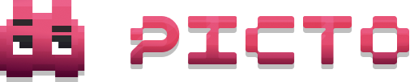

<p align="center">
  
</p>

# picto

Tiny React library for procedural SVG characters. **Seed in, character out.**

Every character is pure inline SVG generated at runtime from a bundled part
catalog — no image files to load, no network, fully deterministic.

```bash
npm install picto
```

## Quick start

```tsx
import { Picto } from 'picto'

// Same seed -> same character, every time.
<Picto seed={7} size={120} />

// A name works too (hashed to a seed).
<Picto seed="ada" />
```

## Define a character explicitly

```tsx
<Picto
  config={{
    color: 'blue',     // anchor color, or use hue: 210
    shape: 2,          // body shape 1..4
    eyes: 'double',    // 'single' | 'double' | 'triple'
    mode: 'hetero',    // 'mono' | 'hetero' | 'triad'
    bg: 3,             // background 1..5
  }}
/>
```

The config is fully typed — import `CharConfig` for autocomplete:

```ts
import type { CharConfig } from 'picto'
const cfg: CharConfig = { color: 'blue', eyes: 'double' }
```

## The `picto.character` API

```tsx
import { picto, Picto } from 'picto'

const c = picto.character(7)            // or picto.character('ada'), or picto.character({...})

c.config                                // the resolved spec (color, shape, eyes, ...)
c.svg()                                 // -> standalone SVG string (works without React)

<Picto char={c} size={120} />

// Imperative animations — drive any mounted <Picto char={c} />:
c.blink()                               // play once
c.jump()                                // play once
c.breath()                              // loops
c.dance()                               // loops
c.stop()                                // stop
```

> **Note:** the animation methods emit to mounted `<Picto char={c} />` components.
> Call them with no `<Picto>` mounted and they're harmless no-ops.

Or play one declaratively:

```tsx
<Picto seed={7} animate="breath" />
```

## Props

| Prop         | Type                              | Default | Notes                                   |
| ------------ | --------------------------------- | ------- | --------------------------------------- |
| `seed`       | `number \| string`                | `0`     | Build a character from a seed.          |
| `config`     | `CharConfig`                      | —       | Build a character from explicit fields. |
| `char`       | `Character`                       | —       | Use an existing character (wins).       |
| `size`       | `number`                          | `120`   | Width = height, in px.                  |
| `background` | `boolean`                         | `true`  | `false` -> transparent.                 |
| `animate`    | `'blink'\|'jump'\|'breath'\|'dance'` | —    | Play declaratively.                     |

Any other `span` props (`className`, `style`, `onClick`, …) pass through.

## Without React

The engine is framework-agnostic:

```ts
import { picto } from 'picto'

const svg = picto.character(42).svg()                  // string of <svg>…</svg>
const bare = picto.character(42).svg({ background: false })  // transparent
const svg2 = picto.character(42).svg({ uid: 'a_' })    // custom id prefix (avoid
                                                       // collisions in one document)
```

`.svg()` output is deterministic per character; ids are prefixed so multiple
characters can live in the same document without clashing.

## Just the seeded RNG

The deterministic RNG/seed helpers are also exposed on their own subpath, with
**none** of the character data — handy if you only want stable randomness:

```ts
import { mulberry32, hashSeed } from 'picto/rng'
const rand = mulberry32(hashSeed('any-string'))
```

## License

MIT
